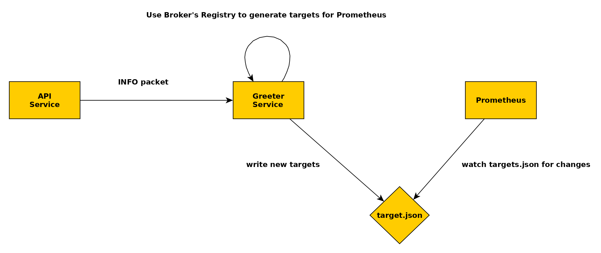
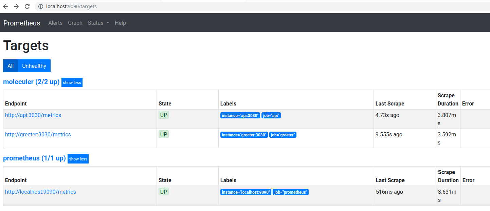

# moleculer-prometheus-demo [](https://moleculer.services)

This is a PoC showing how to use Prometheus [File-based Service Discovery](https://prometheus.io/docs/guides/file-sd/) to dynamically find and scrap metrics from Moleculer services.

> This demo is based on [moleculer-demo](https://moleculer.services/docs/0.13/usage.html#Create-a-Moleculer-project)

### The Idea

Moleculer Services have [built-in registry mechanism](https://moleculer.services/docs/0.14/registry.html) that handles the discovery of new nodes. This repo shows how to use this feature (via small [`middleware/prometheus-sd.js`](middleware/prometheus-sd.js)) to add on-the-fly new targets to Prometheus.

**Overview**


## Example

Run `npm run dc:up` and open [http://localhost:9090/targets](http://localhost:9090/targets). You should get something like:


### Useful Links

- [http://localhost:3000/](http://localhost:3000/) - Make a call to [API Gateway](https://moleculer.services/docs/0.14/moleculer-web.html)
- [http://localhost:3001/dashboard/](http://localhost:3001/dashboard/) - Call [Traefik](https://traefik.io/)
- [http://localhost:9090/graph](http://localhost:9090/graph) - Call Prometheus server
- [http://localhost:9100/metrics](http://localhost:9100/metrics) - Check `api` service metrics
- [http://localhost:9200/metrics](http://localhost:9100/metrics) - Check `greeter` service metrics

## Guide

1. Open `moleculer.config.js`, enable metrics and set Prometheus as a reporter. [More info](https://moleculer.services/docs/0.14/metrics.html#Prometheus)

   **moleculer.config.js**

   ```js
   {
     // Other configs
     metrics: {
           enabled: true,
           reporter: [
               {
                   type: "Prometheus",
                   options: {
                       // HTTP port
                       port: 3030,
                       // HTTP URL path
                       path: "/metrics",
                       // Default labels which are appended to all metrics labels
                       defaultLabels: registry => ({
                           namespace: registry.broker.namespace,
                           nodeID: registry.broker.nodeID
                       })
                   }
               }
           ]
       }
   }
   ```

2. Create a `prometheus` folder at top dir.

3. Mount `prometheus` folder for `greeter` service. (Optional) Define a `hostname` for the `greeter` container and a `port` to expose its metrics. Repeat the same steps for `api` service.

   **docker-compose.yml**

   ```yml
   greeter:
     build:
       context: .
     image: moleculer-prometheus-demo
     hostname: greeter ## (Optional) Define the hostname
     container_name: moleculer-prometheus-demo-greeter
     env_file: docker-compose.env
     environment:
       SERVICES: greeter
     labels:
       - "traefik.enable=false"
     depends_on:
       - nats
     ports:
       - 9200:3030 ## (Optional) Add a port in order to access the metrics
     networks:
       - internal
     volumes:
       - ./prometheus:/etc/prometheus ## mount "prometheus" dir. Greeter will write into this folder
   ```

4. Create a container for [Prometheus](https://prometheus.io/). Mount `prometheus` folder.

   **docker-compose.yml**

   ```yaml
   prometheus:
     image: prom/prometheus:latest
     container_name: prometheus
     ports:
       - 9090:9090
     command:
       - --config.file=/etc/prometheus/prometheus.yml # Set the configuration file
     volumes:
       - ./prometheus:/etc/prometheus:ro ## mount "prometheus" dir. Prometheus will read targets from here
     networks:
       - internal
   ```

5. Create a configuration file `prometheus.yml` for Prometheus

   **prometheus.yml**

   ```yml
   ## General configs
   global:
     scrape_interval: 15s
     scrape_timeout: 10s
     evaluation_interval: 15s
   alerting:
     alertmanagers:
       - static_configs:
           - targets: []
         scheme: http
         timeout: 10s
         api_version: v1
   scrape_configs:
     - job_name: prometheus
       honor_timestamps: true
       scrape_interval: 15s
       scrape_timeout: 10s
       metrics_path: /metrics
       scheme: http
       static_configs:
         - targets:
             - localhost:9090
     ## Add a job for Moleculer services
     - job_name: "moleculer"
       scheme: http
       file_sd_configs:
         - files:
             - "targets.json" ## File where greeter service will place targets and Prometheus will read.
           refresh_interval: 10s
   ```

6. Open `docker-compose.env` and specify the location where `prometheus` folder is mounted and the name of the targe file.

   **docker-compose.env**

   ```bash
   NAMESPACE=
   LOGGER=true
   LOGLEVEL=info
   SERVICEDIR=services

   TRANSPORTER=nats://nats:4222

   ### Prometheus Targets File
   TARGETDIR=etc/prometheus ## Dir where "prometheus" were mounted in Steps 3. and 4.
   TARGETFILE=targets.json  ## File name that were specified in Step 5.

   ```

7. Run `npm run dc:up`.

8. Check the `targets.json`. It should contain 2 targets for Prometheus to track and scrap metrics.

**targets.json**

```js
[
  {
    labels: {
      job: "api"
    },
    targets: ["api:3030"] // "api" is the hostname that we've defined in docker-compose.yml
  },
  {
    labels: {
      job: "greeter"
    },
    targets: ["greeter:3030"] // "greeter" is the hostname that we've defined in docker-compose.yml
  }
];
```

### Note:

Errors such as

```bash
prometheus | level=error ts=2019-11-08T10:24:45.830Z caller=file.go:323 component="discovery manager scrape" discovery=file msg="Error reading file" path=/etc/prometheus/targets.json err="unexpected end of JSON input"
```

might happen if Prometheus tries to read the file at the same time that `greeter` service is writing new targets. However, it's not a big issue as Prometheus reads this file periodically, so next time it will read a valid target file.
